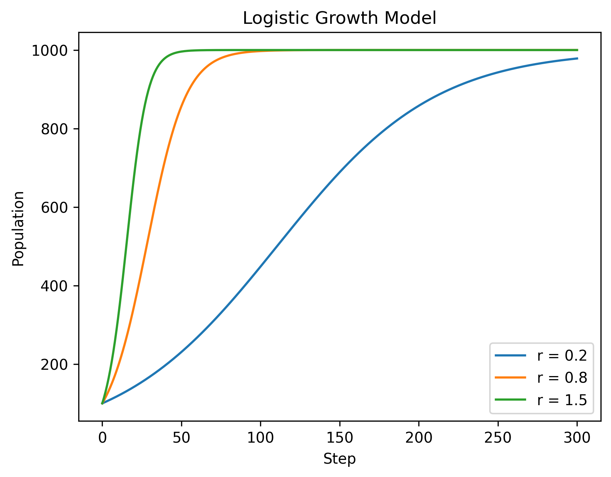

# Mathematical Systems Explorer

**Author:** Xirui Gong

This project marks the first step of my journey into computational modelling. I hope each future project will build upon what I learn here.

A Python project exploring how mathematics can be used to model, understand and predict real-world systems.

## Project Overview

This project combines ordinary differential equations, numerical methods and scientific visualisation to study real-world phenomena.

The goal is to bridge mathematics, programming and computational modelling through numerical simulations.

## Skills Demonstrated

- Python programming
- Mathematical modelling
- Ordinary differential equations
- Numerical methods
- Dynamical systems
- Stability analysis
- Scientific visualisation
- Git and GitHub

## Models Included

- Logistic Growth
- Predator–Prey Dynamics
- SIR Epidemic Model
- Two-Species Competition Model

## Logistic Growth

The logistic growth model was used to study population growth under limited resources.

The model is governed by:

```text
dP/dt = rP(1 - P/K)
```

where:

- `P` is the population
- `r` is the growth rate
- `K` is the carrying capacity

Topics explored:

- Carrying capacity
- Equilibrium points
- Stability
- Long-term behaviour
- The effect of changing the growth rate

Three simulations were performed using different growth rates:

```text
r = 0.2, 0.8, 1.5
```

Larger values of `r` cause the population to approach the carrying capacity more quickly. All positive solutions approach the same long-term equilibrium.

The equilibria are:

- `P = 0`, which is unstable
- `P = K`, which is stable



## Predator–Prey Dynamics

The Lotka–Volterra model was used to study interactions between predator and prey populations.

The model demonstrates:

- Cyclic population behaviour
- Phase-plane trajectories
- Equilibrium points
- Dependence on initial conditions
- Vector-field visualisation

Vector fields were added to show the direction of motion throughout the phase plane.

Euler's method and RK4 were also compared. RK4 preserves the closed-orbit behaviour more accurately than Euler's method.


## SIR Epidemic Model

The SIR model divides a population into three groups:

- Susceptible (`S`)
- Infected (`I`)
- Recovered (`R`)

The simulations investigate:

- Infection dynamics
- Peak infection levels
- The effect of the transmission rate `β`
- The effect of the recovery rate `γ`
- Parameter sweeps

Changing `β` affects both the height and timing of the infection peak. Increasing `γ` causes infected individuals to recover more quickly.


## Numerical Methods

The project compares two numerical methods for solving differential equations.

### Euler Method

Euler's method is a first-order numerical approximation based on the slope at the beginning of each time step.

It is simple to implement, but its accuracy depends strongly on the selected step size.

### Runge–Kutta 4

The fourth-order Runge–Kutta method uses four slope estimates during each time step.

It is significantly more accurate than Euler's method for the same step size.

The methods were compared using:

- Exponential growth
- Predator–prey dynamics
- Long-term phase-plane behaviour

## Competition Model

A two-species competition model was implemented to study competition for limited resources.

Topics explored:

- Nullclines
- Equilibrium points
- Saddle points
- Basins of attraction
- Dependence on initial conditions
- Vector fields
- Phase portraits

The simulations show how different initial populations can lead to different long-term outcomes.

The phase portrait below shows trajectories, nullclines, equilibrium points and the vector field.


## Project Structure

```text
dynamical-systems-explorer/
├── README.md
├── requirements.txt
├── figures/
│   ├── competition_phase_portrait.png
│   ├── logistic_growth.png
│   ├── predator_prey_phase_portrait.png
│   └── sir_model.png
└── src/
    ├── competition.py
    ├── competition_nullclines.py
    ├── euler.py
    ├── phase_portrait.py
    ├── predator_prey.py
    ├── predator_prey_rk4.py
    ├── rk4.py
    └── sir.py
```

## Requirements

The project requires:

```text
numpy
matplotlib
```

Install the required packages using:

```bash
pip install -r requirements.txt
```

## Running the Project

Run individual simulations from the project root directory.

For example:

```bash
python3 src/predator_prey.py
```

```bash
python3 src/sir.py
```

```bash
python3 src/competition.py
```

## Future Improvements

- Interactive parameter sliders
- Additional ecological models
- Improved visualisation tools
- Automated phase-portrait generation
- Interactive dashboards
- A Streamlit web application