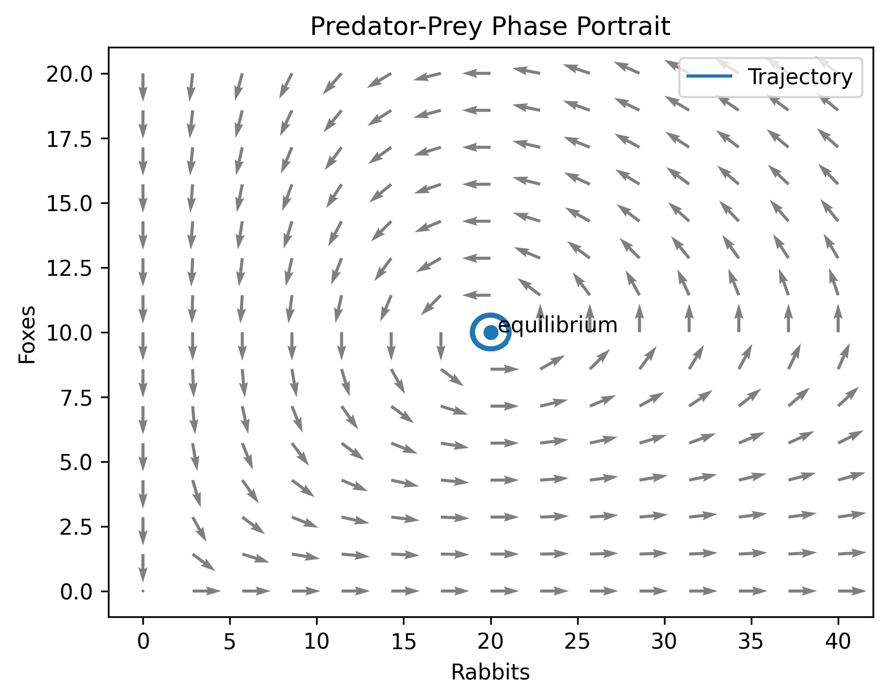
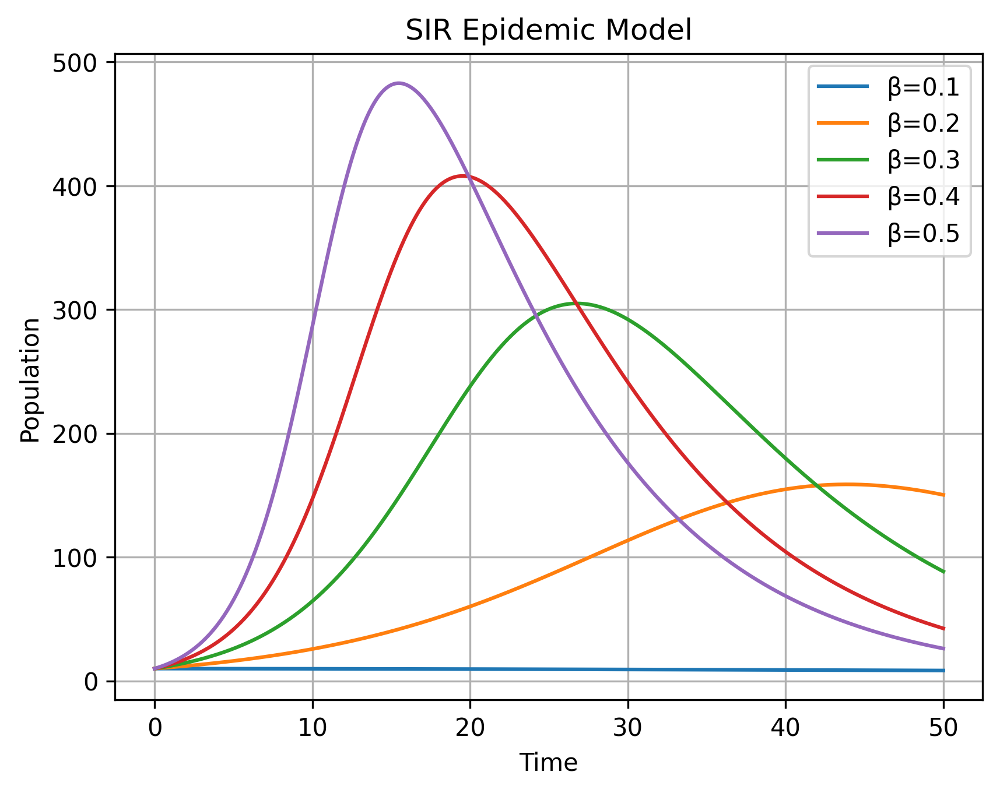
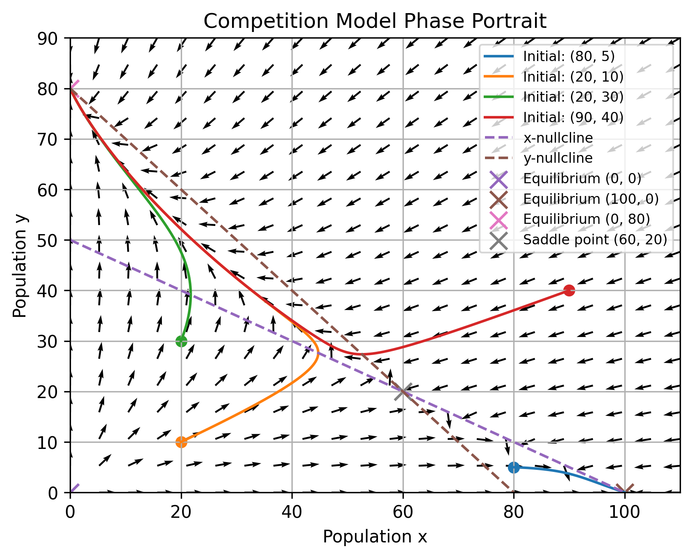

# Mathematical Systems Explorer
Author: Xirui Gong

This project marks the first step of my journey into computational modelling. I hope each future project will build upon what I learn here.

A Python project exploring how mathematics can be used to model, understand and predict real-world systems.

## Project Overview

This project combines ordinary differential equations (ODEs), numerical methods and data visualisation to study real-world phenomena.

The goal is to bridge mathematics, programming and computational modelling through interactive simulations.

### Skills Demonstrated

- Python Programming
- Numerical Methods
- Differential Equations
- Dynamical Systems
- Scientific Visualisation
- Git & GitHub

## Modules

### 1. Epidemic Spread

Question:

How quickly can a disease spread under different transmission rates?

Topics:

- Exponential growth
- Euler's method
- Error analysis

### 2. Investment Growth

Question:

How does wealth evolve under different interest rates?

Topics:

- Continuous growth models
- Numerical approximation
- Long-term behaviour

### 3. Predator-Prey Dynamics

Question:

How do interacting species evolve over time?

Topics:

- Dynamical systems
- Phase portraits
- Stability analysis

## Skills Demonstrated

- Python
- Mathematical modelling
- Numerical methods
- Data visualisation
- Dynamical systems

## Future Improvements

- Interactive parameter sliders
- Additional ecological models
- Improved visualisation tools
- Phase portrait automation
- Interactive dashboards

## Research Notes

Experiment 1: Effect of Growth Rate

Three simulations were performed with different growth rates
(r = 0.2, 0.8, 1.5).

Observation:
- Larger values of r lead to faster population growth.
- Smaller values of r lead to slower population growth.
- All simulations approach the same equilibrium value K = 1000.

Conclusion:
The growth rate r controls how quickly the system approaches equilibrium,
while the carrying capacity K determines the long-term population level.

## Stability Analysis

For the logistic equation

dP/dt = rP(1 - P/K),

the equilibria are:

- P = 0 (unstable)
- P = K (stable)

The simulations confirm that solutions with positive initial conditions converge to the stable equilibrium P = K.

### Predator–Prey Dynamics

The Lotka–Volterra model was used to study interactions between predator and prey populations.

The model demonstrates:

- Cyclic population behaviour
- Phase plane trajectories
- Equilibrium points
- Dependence on initial conditions

Vector fields were added to visualise the direction of motion throughout the phase plane.

The behaviour of Euler's Method and RK4 was compared, showing that RK4 preserves the closed orbits much more accurately.

## SIR Epidemic Model

The SIR model divides a population into:

- Susceptible (S)
- Infected (I)
- Recovered (R)

The simulations investigate:

- Infection dynamics
- Peak infection levels
- The effect of transmission rate β
- The effect of recovery rate γ

Parameter sweeps were used to analyse how changing β affects the epidemic curve.

## Numerical Methods

The project compares two numerical methods:

### Euler Method

A simple first-order approximation.

### Runge–Kutta 4 (RK4)

A higher-order method with significantly improved accuracy.

The methods were compared on both exponential growth and predator–prey systems.

## Competition Model

A two-species competition model was implemented to study resource competition.

Topics explored:

- Nullclines
- Equilibria
- Saddle points
- Basins of attraction
- Dependence on initial conditions

The simulations show how different initial populations can lead to different long-term outcomes.

The phase portrait below shows trajectories, nullclines, equilibrium points and the vector field for the competition model.

